# 🚐 Shuttle Solutions

  

  <strong>A user-centred mobile application that simplifies shuttle bookings for university students.</strong>

  
  
  

---
## Navigation

- [Overview](#overview)
- [Research](docs/research.md)
- [Define](docs/define.md)
- [Ideation](docs/ideation.md)
- [Prototype](docs/prototype.md)
- [Testing](docs/testing.md)
- [Reflection](docs/reflection.md)
- [About](docs/about.md)
- [My Contributions](docs/contributions.md)
- [Future Improvements](docs/future-improvements.md)
  
# 📖 Overview

Shuttle Solutions is a mobile application designed to improve the way students book long-distance transportation from Rhodes University.

The project followed a complete Human-Centred Design (HCD) process—from understanding user needs through interviews and empathy mapping to designing, prototyping, and evaluating a mobile application that addresses common transportation frustrations.

Rather than focusing solely on functionality, the project prioritised usability, trust, convenience, and affordability to create a seamless booking experience.

---

# Project Summary

| | |
|---|---|
| Duration | 6 Weeks |
| Team | 6 Designers |
| Role | UX Designer |
| Methods | Interviews, Personas, Storyboarding, Prototyping |
| Testing | 5 Participants |

# 🎯 Problem

Students travelling between Rhodes University and surrounding cities often rely on fragmented communication channels such as Facebook, WhatsApp, and phone calls to arrange transportation.

This process creates several challenges:

- Finding trustworthy shuttle providers
- Comparing prices
- Booking efficiently
- Verifying driver reliability
- Managing payments

These issues increase stress and uncertainty during travel planning.

---

# 🎯 Project Goal

Design an intuitive mobile application that enables students to

- Discover available shuttle services
- Compare drivers
- Book transportation
- Pay securely
- Rate their experience

while reducing cognitive load and improving confidence throughout the booking process.

---

# Design Process

🔍 Research
      ↓
🧠 Define
      ↓
💡 Ideate
      ↓
📱 Prototype
      ↓
🧪 Test
      ↓
🔄 Iterate

---

# 🔍 User Research

## Research Methods

- User Interviews
- Needfinding
- Empathy Mapping
- Behaviour Analysis

### Key Insights

✅ Students value convenience

✅ Trust strongly influences booking decisions

✅ Friends are the primary source of recommendations

✅ Existing booking methods are fragmented

✅ Price transparency is important

---

## Empathy Map

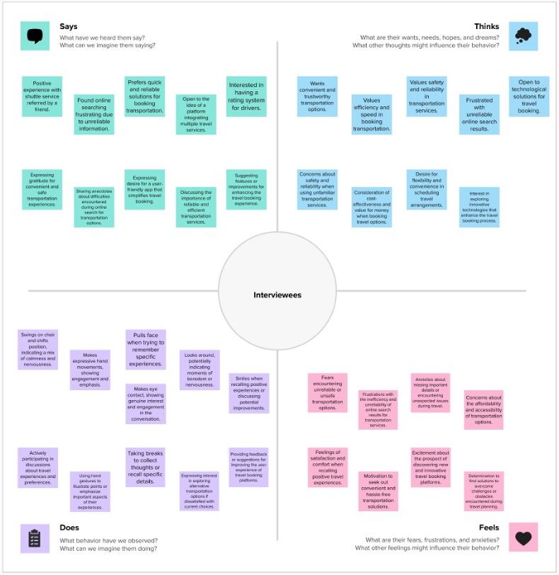

The empathy mapping exercise revealed that students experience uncertainty throughout the booking journey, particularly when evaluating shuttle providers and waiting for transportation.

---

# 👤 User Persona

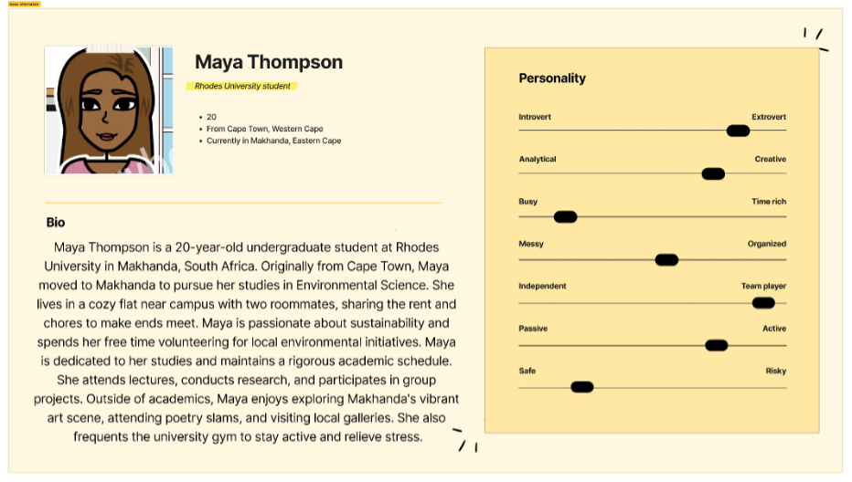

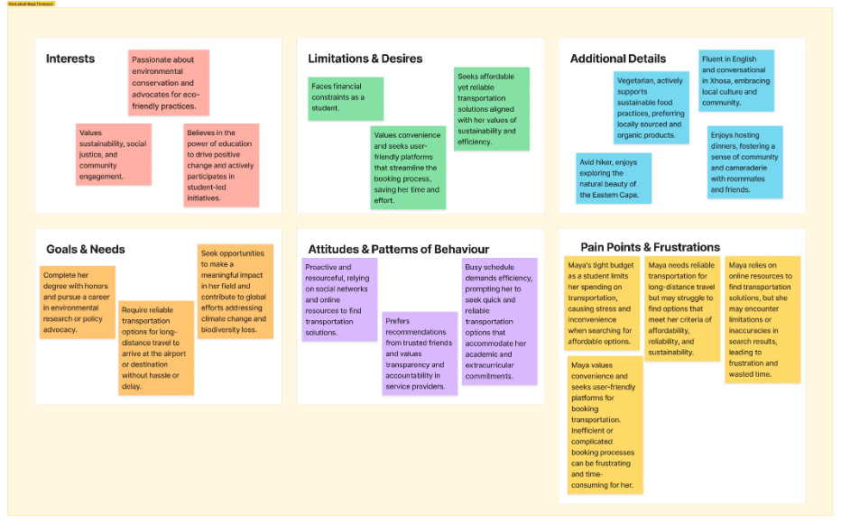

### Goals

- Book transport quickly
- Feel safe while travelling
- Find trustworthy drivers
- Stay within budget

### Frustrations

- Searching Facebook repeatedly
- Slow responses from providers
- Unclear pricing
- No reliable rating system

---

# 💡 Defining the Opportunity

## Point of View

Students travelling long distances need a reliable and transparent booking experience because current transportation services are fragmented and difficult to trust.

---

# ❓How Might We...

- Build trust between students and drivers?
- Reduce booking time?
- Improve payment flexibility?
- Make transportation more affordable?
- Improve the overall travel experience?

---

# ✏️ Ideation

## Initial Concept Sketches

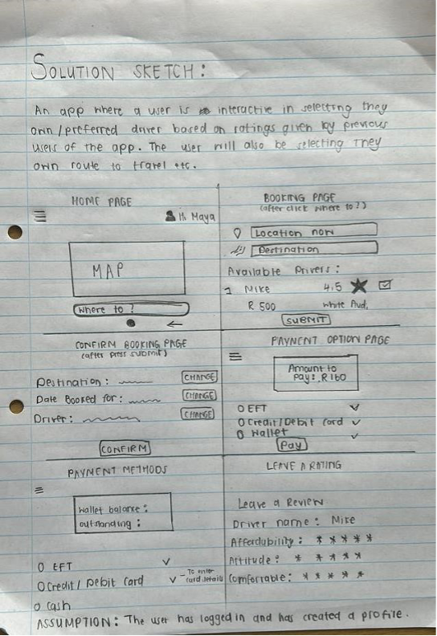

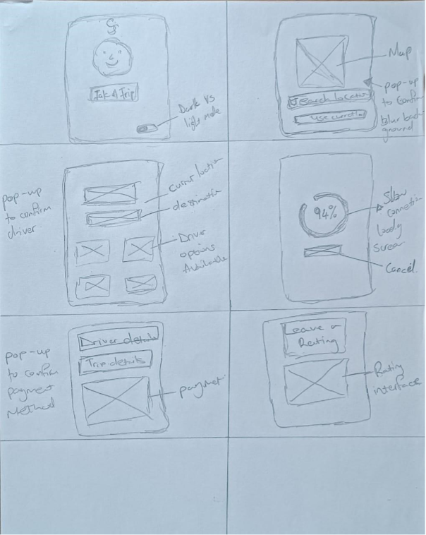

Multiple concepts were explored before selecting the strongest interaction patterns.

---

# 📚 Storyboards

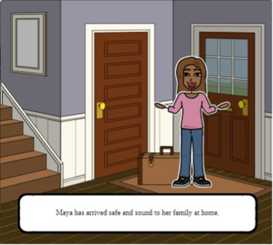

Storyboards were used to visualise the complete user journey before designing interface layouts.

---

# 📱 Wireframes

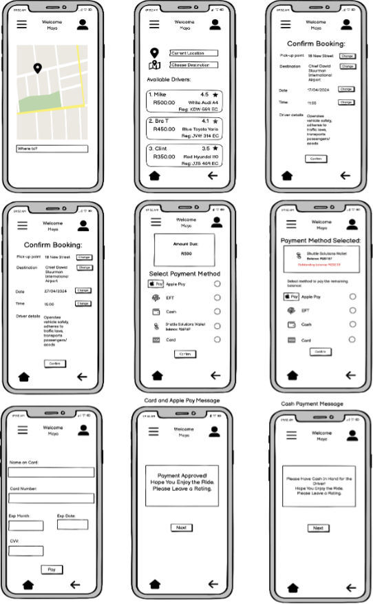

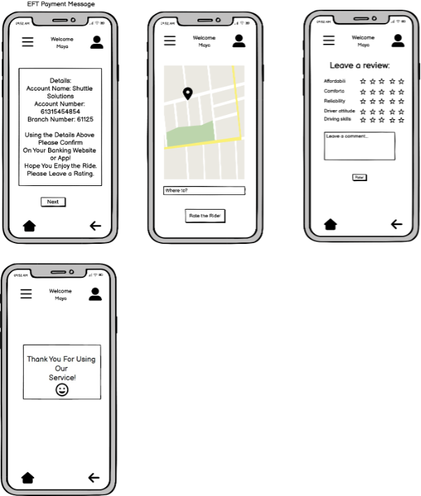

Low-fidelity wireframes translated conceptual ideas into interactive screens that could be evaluated with users.

---

# ✂️ Paper Prototype

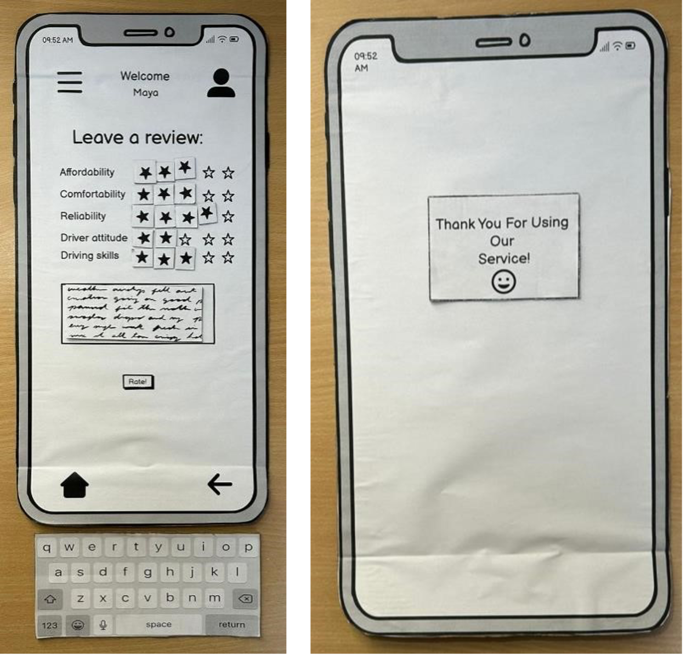

Paper prototypes allowed rapid iteration before investing time in digital interfaces.

---

# 🧪 Usability Testing

Five participants completed realistic booking scenarios.

The study evaluated

- Navigation
- Learnability
- Booking flow
- Payment
- Driver selection

---

## Key Findings

| Problem | Improvement |
|----------|-------------|
| Users hesitated on the landing page | Redesigned the landing screen |
| Information overload | Split destination and driver selection |
| Wallet feature misunderstood | Added contextual information icon |

---

# 📈 Design Improvements

### Before

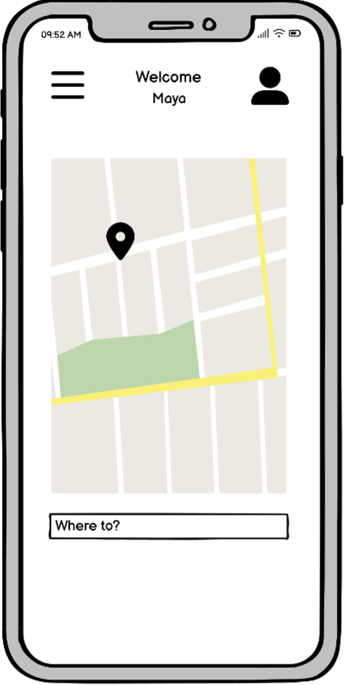

### After

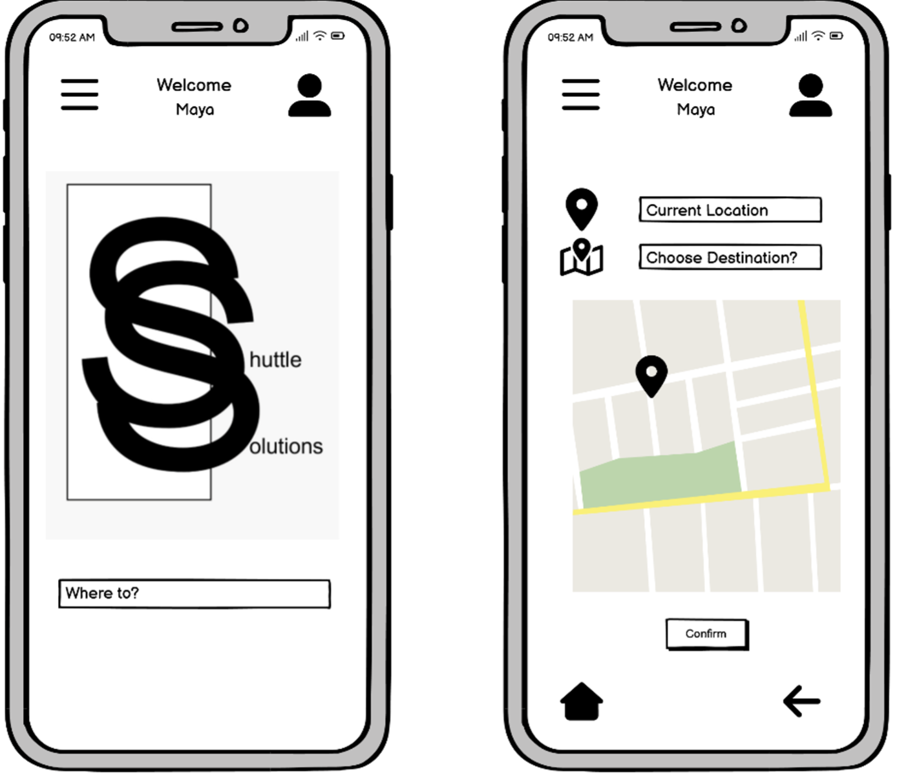

### Before

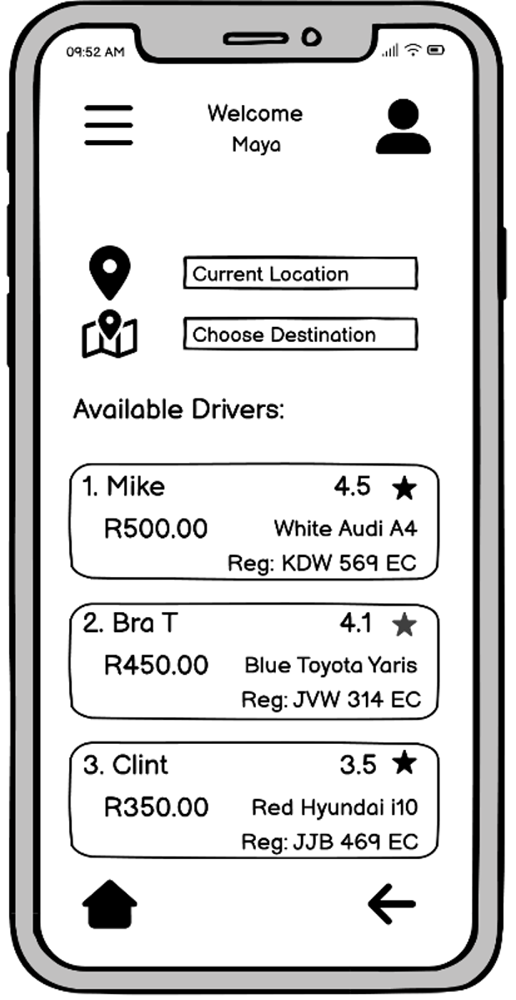

### After

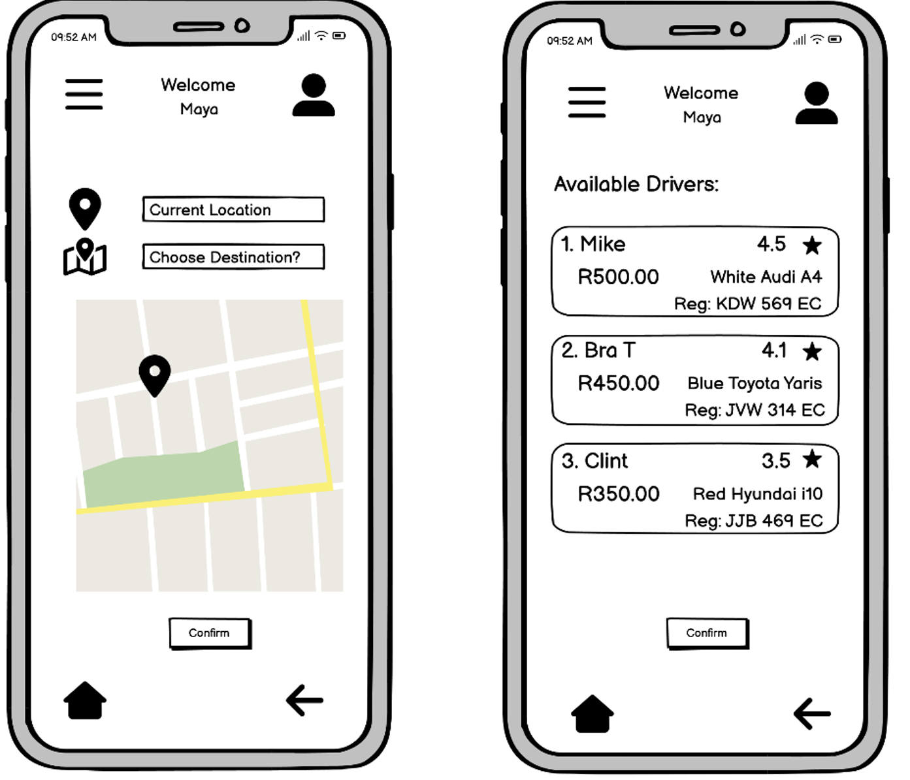

### Before

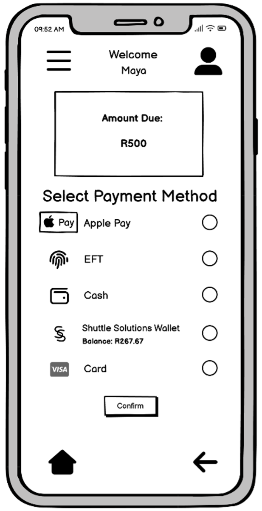

### After

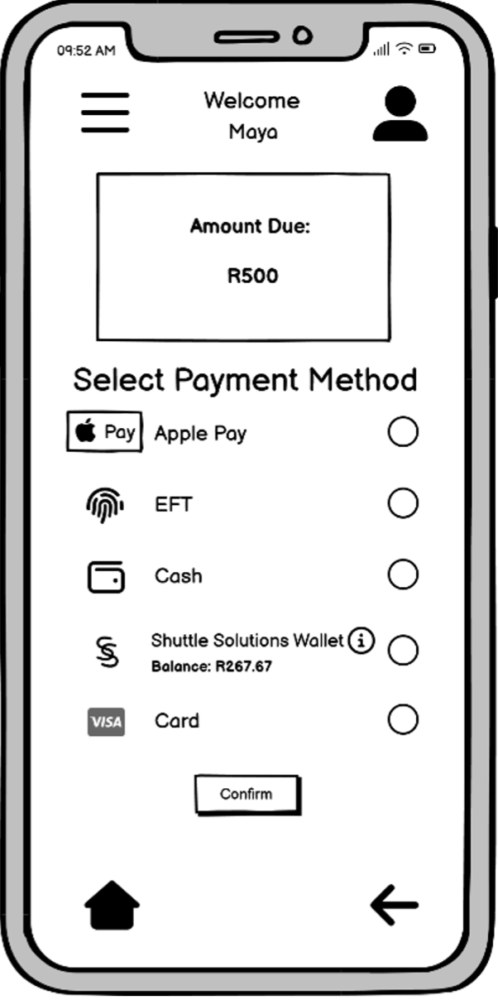

The redesign simplified navigation, reduced cognitive load, and improved clarity during the booking process.

---

# 🎓 Reflection

This project demonstrated the importance of iterative design and continuous user feedback.

Rather than assuming what users wanted, every major design decision was informed by observations, interviews, prototyping, and usability testing.

The experience reinforced that successful digital products emerge through repeated cycles of testing and refinement rather than from a single design iteration.

---

# 🛠 Tools

---

## 👥 Team

- **Ongeziwe Pama**
-  Mia Franco
- Inam Gazi
- Vuyolwethu Makamba
- Farai Musariri
- Vuyo Ntamo
